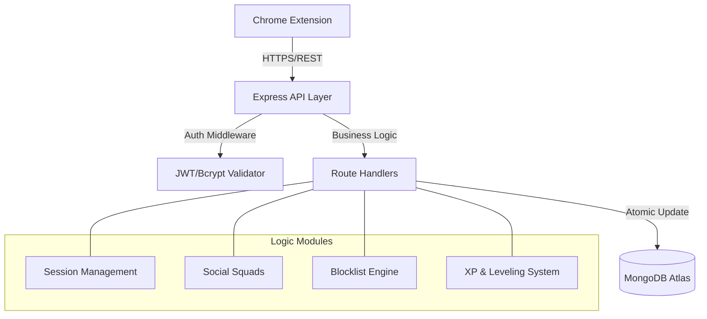

# 🏗️ FocusForge Architecture Documentation

This document outlines the architectural design, data flow, and technical decisions behind the FocusForge Backend, specifically optimized for the Chrome Extension ecosystem.

## 1. System Overview
FocusForge follows a **Layered Monolithic Architecture**. It is designed to be a high-throughput, stateless REST API that manages the gamified lifecycle of focus sessions and social productivity features.

### Architecture Diagram (High Level)

## 2. Core Modules

### A. Session Engine (`routes/sessions.js`)
Handles the lifecycle of a focus block. 
- **Start**: Initializes a session timestamp.
- **End**: Calculates duration, awards XP (1 XP/min), and updates user streak logic.
- **Fail/Abort**: Implements **"All or Nothing"** logic. If a session is manually terminated or fails due to a Hard Mode violation, any XP accumulated during that session is instantly reverted from the user's `globalXP`.

### B. Identity & Social (`routes/auth.js`, `routes/squads.js`)
- **Stateless Auth**: Uses JWT with a 7-day TTL.
- **Squad Logic**: Competitive clusters where members share `isLive` status and focusXP rankings.

### C. Interception & Blocking (`routes/blocklist.js`, `routes/interceptions.js`)
- **Domain Management**: Synchronized blocklists between the extension and backend.
- **Bypass Registry**: Temporary grace periods (2 mins) for "Stolen Time" after correct mindfulness answers.
- **Interception Logs**: Captures blocked site attempts, categorizing distractions for AI-powered feedback/roasts.

## 3. Real-time State Synchronization

### 📈 Smooth XP Formula
To prevent visual "jitter" or resets when the background alarm is delayed, the UI uses a **Timer-Driven Smooth XP** formula:
`DisplayXP = Math.max(0, (ElapsedTime / 60000) - TotalPenalties)`
This ensures the decimal part ticks up perfectly in sync with the countdown timer, while the whole part is corrected by any server-side penalties.

## 4. Extended Data Model

### User Schema (Central)
| Field | Type | Description |
|-------|------|-------------|
| `username` | String | Unique identity |
| `focusXP` | Number | Experience points |
| `level` | Number | Calculated: `floor(XP/100) + 1` |
| `currentStreak`| Number | Daily focus consistency |
| `hardModeEnabled`| Boolean| If true, failures have higher penalties |
| `squadId` | ObjectId | Reference to the user's squad |

### Supporting Schemas
- **FocusSession**: Tracks start/end, status, and XP yield.
- **Squad**: Manages member lists, live statuses, and ownership.
- **Blocklist**: Per-user domain arrays.
- **InterceptionLog**: Detailed records of blocked domain hits and resolution status.

## 5. Architectural Decisions

### 🛡️ Chrome Extension CORS
The API implements a dynamic CORS policy that recognizes and trusts `chrome-extension://` origins, facilitating secure communication from the browser's background and sidepanel scripts.

### ⚡ Gamification Logic (XP/Leveling)
The backend enforces dynamic leveling. Instead of client-side calculation, the server re-evaluates levels during XP updates to ensure consistency and prevent tampering.

### 🔄 Streak Persistence
Streak logic is calculated server-side. When a session completes, the system compares `lastFocusDate` to the current date. If the gap is exactly 1 day, the streak increments; if larger, it resets.

---
*Last Updated: May 2026 (Extension Refactor)*
