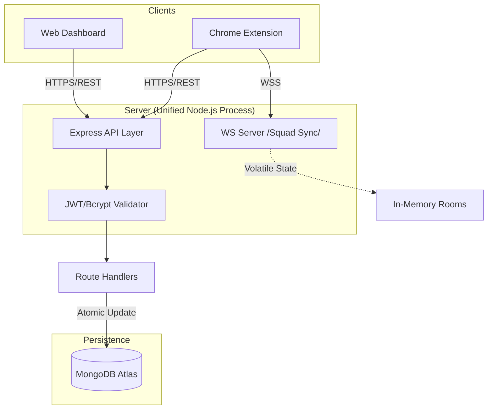

# 🏗️ FocusForge Architecture Documentation

This document outlines the architectural design, data flow, and technical decisions behind the FocusForge Backend, optimized for the Chrome Extension ecosystem and real-time collaboration.

## 1. System Overview
FocusForge follows a **Layered Monolithic Architecture** with a **Hybrid Communication Layer**. It integrates a stateless REST API for persistence and a stateful WebSocket server for real-time synchronization.

### High-Level Architecture Diagram

## 2. Communication Layers

### A. RESTful API (Stateless Persistence)
Handles the core business logic where data durability is required.
- **Authentication**: JWT-based stateless sessions.
- **XP Management**: Delta-based updates to prevent inflation.
- **Squad Persistence**: Managing long-term memberships and historical leaderboards.
- **Blocklists**: Synchronizing domain rules across devices.

### B. WebSocket Layer (Stateful Real-time)
A volatile communication layer attached to the same HTTP port as the Express server.
- **Purpose**: Low-latency broadcasting of "Live" status and session XP.
- **Rooms**: In-memory ephemeral clusters (Volatile). Unlike persistent squads, these rooms disappear when the server restarts or all members leave.
- **Events**: `host`, `join`, `update_state`, and `leave`.

## 3. The Hybrid Squad Model
FocusForge distinguishes between **Persistent Squads** and **Volatile Rooms**:

| Feature | Persistent Squads (REST) | Volatile Rooms (WS) |
|---------|-------------------------|---------------------|
| **Storage** | MongoDB | In-Memory (`rooms` object) |
| **Identity** | 5-Digit Numerical Code | 5-Character Alphanumeric ID |
| **Membership** | Saved across sessions | Lost on disconnect |
| **Best For** | Global Rankings, Friend Lists | Live Study Sessions, "Focus Parties" |

## 4. Real-time State Synchronization

### 📈 Delta-Based XP Sync
To prevent cumulative XP bugs and visual jitter, FocusForge uses a **Strict Delta Sync** mechanism:
1. The extension tracks local session time.
2. Every 60 seconds of focus, it sends `{ xpDelta: 1 }` to the backend REST API.
3. The backend uses MongoDB's `$inc` operator to atomically increment `focusXP` and `totalFocusMinutes`.
4. Simultaneously, the client sends an `update_state` message via WebSocket to broadcast the new XP to the live room.

## 5. Security & Connectivity

### 🛡️ Chrome Extension CORS
The API implements a dynamic CORS policy:
- **Trust-by-Protocol**: Allows any origin starting with `chrome-extension://`. This is critical for supporting multiple developer IDs and side-loading.
- **Credential Support**: Enables secure cookie/header-based auth from extension background scripts.

### ⚡ Atomic XP Consistency
The backend re-evaluates levels during every XP update. This ensures that the Level-up logic is always server-side authoritative, preventing client-side spoofing.

## 6. Deployment Architecture (Render)
The application is designed for single-process deployment on Render.
- **Port Sharing**: The Node.js `http.Server` instance is shared between Express and the `ws` library.
- **Environment Aware**: Dynamically switches CORS and DB strings based on environment variables.

---
*Last Updated: May 2026 (Unified Port & WS Refactor)*
